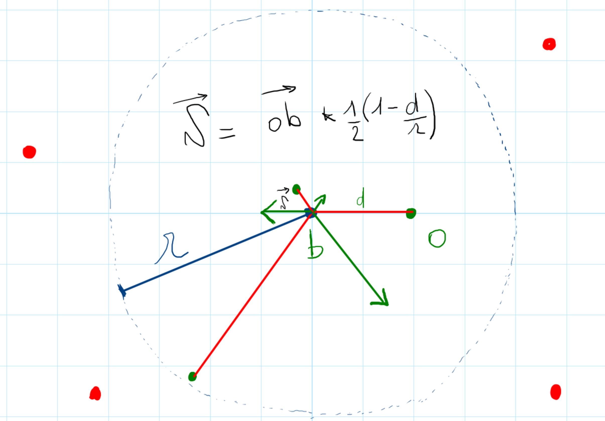

---
jupytext:
  cell_metadata_filter: all, -hidden, -heading_collapsed, -run_control, -trusted
  notebook_metadata_filter: all, -jupytext.text_representation.jupytext_version, -jupytext.text_representation.format_version,
    -language_info.version, -language_info.codemirror_mode.version, -language_info.codemirror_mode,
    -language_info.file_extension, -language_info.mimetype, -toc
  text_representation:
    extension: .md
    format_name: myst
kernelspec:
  display_name: Python 3 (ipykernel)
  language: python
  name: python3
language_info:
  name: python
  nbconvert_exporter: python
  pygments_lexer: ipython3
nbhosting:
  title: 'TP: les boids'
rise:
  autolaunch: true
  slideNumber: c/t
  start_slideshow_at: selected
  theme: sky
  transition: cube
---

<div class="licence">
<span>Licence CC BY-NC-ND</span>
<span>Thierry Parmentelat</span>
</div>

+++

# TP - les boids avec `import arcade`

+++

## introduction

dans ce TP nous allons

* découvrir (très superficiellement) la librairie `arcade`
* et l'utiliser pour implémenter un début de simulation de *boids*

+++

### la librairie `arcade`

il s'agit d'une librairie Python pour construire des jeux; un peu comme `pygame` donc, mais on s'y intéresse ici parce que le modèle de programmation avec `arcade` est par essence beaucoup **plus orienté objet**

<https://api.arcade.academy/en/latest/>

+++

### c'est quoi les *boids*

c'est le nom qu'on donne à une simulation d'un groupe d'animaux - pensez, oiseaux ou poissons

dans sa version originale chaque animal décide de sa trajectoire, **en fonction uniquement de ses voisins proches**, et cela en suivant trois règles:

* séparation (typiquement pour éviter les obstacles)
* alignement (tout le monde va, en gros, dans la même direction)
* cohésion (rester groupés)

+++

### notre sujet

pour la partie imposée de ce TP, on va se contenter d'implémenter la **règle de séparation**  
c'est-à-dire ce qui permet aux boids d'éviter de heurter les autres boids, et les obstacles

les élèves rapides et/ou motivés pourront poursuivre jusqu'à réaliser une simulation complète s'ils le souhaitent

+++

### en vidéo

voici d'abord une vidéo très courte pour vous montrer les différentes étapes du TP

<https://www.youtube.com/watch?v=d4789cBD3Ek>

l'enjeu principal ici est d'être exposé à ce style de **programmation par spécialisation de classes**  
aussi ce chemin est uniquement **indicatif**, et surtout à destination des élèves qui en ressentiront le besoin  
si vous vous sentez, vous pouvez très bien vous y prendre complètement autrement,  
le contrat est rempli dès que vous avez: **des obstacles** fixes, et **des boids** qui évoluent **spontanément** en **évitant** les autres objets

+++

## pas à pas

+++

### v01: starter code

```python
"""
display a single object, inert, at (100, 100)
"""

import arcade

BACKGROUND = arcade.color.ALMOND
IMAGE = "arrow-resized.png"

class Window(arcade.Window):

    def __init__(self):
        super().__init__(800, 800, "My first boid")
        arcade.set_background_color(BACKGROUND)
        self.boid = None

    def setup(self):
        boid = arcade.Sprite(IMAGE)
        boid.center_x = 100
        boid.center_y = 100
        self.boid = boid

    def on_draw(self):
        arcade.start_render()
        self.boid.draw()

    def on_update(self, delta_time):
        self.boid.update()

window = Window()
window.setup()
arcade.run()
```

* installez la librairie
* vérifiez que vous avez le fichier `arrow-resized.png` (il est dans le repo)
* copiez et lancez le code ci-dessus

vous devez voir un seul boid immobile, dans le coin en bas à gauche

+++

installez la librairie, copiez le code ci-dessus dans par exemple `boid.py`, et lancez-le  
vous devez voir un seul boid dans le coin en bas à gauche

+++

#### commentaire

observez la différence de style de programmation par rapport à `pygame`  
comment aurait-on écrit la même chose en `pygame` ?

+++

#### l'implicite

dans ce code, on utilise - et ce n'est pas du tout explicite - le fait que

* le module `arcade` vient avec une *mainloop* - `arcade.run()`  
  qui se charge de faire 'avancer' le jeu - par défaut à plusieurs dizaines de Hz
* cette mainloop va appeler les méthodes `on_draw()` et `on_update()`  
  sur chaque instance de `Window` - c'est là que nous pouvons programmer  
  la logique de notre "*jeu*"
* la classe `Sprite` permet d'ajouter des objets qui savent s'afficher  
  ici on a juste créé l'objet à partir d'un png, puis fixé `boid.center_x` et `boid.center_y`
  
pour les forts: dans le même registre, mais plus subtil:

* il a suffi qu'on crée une instance de `Window`  
  pour qu'elle soit prise en compte par cette boucle;  
  comment c'est possible d'après vous ?

+++

### v02: de la place pour plusieurs boids

on veut garder exactement le même comportement (un seul boid fixe pour l'instant)  
mais on va modifier le code pour pouvoir (plus tard) en créer plusieurs 

pour cela, on pourrait penser à utiliser une liste standard Python,  
mais je vous invite à utiliser plutôt la classe `SpriteList` que fournit `arcade`

+++

#### debugging

en plus de ça, je vous recommande de:
* prévoir le cas du debug, par exemple avec une variable globale DEBUG
* et dans ce cas afficher un message à chaque fois que le boid est mis à jour  
  (surtout pour mettre en évidence la *mainloop* à ce stade)
* et aussi de [regarder la méthode `set_update_rate()`](https://api.arcade.academy/en/latest/api/window.html?highlight=set_update_rate#arcade.Window.set_update_rate)  
  pour ralentir la cadence, ce qui sera sûrement utile à un moment donné pour débugger
* pourquoi ne pas aussi imprimer un message pour voir à quel rythme sont faits les `draw()` et `update()`

+++

### v03: le boid avance

maintenant on va faire bouger notre objet, et lui donner un mouvement rectiligne   

et pour ça on va cesser d'utiliser directement la classe `Sprite`, 
et on va au contraire la **spécialiser** pour créer notre propre classe `Boid`  
(c-à-d que la classe `Boid` hérite de la classe `Sprite`)

#### à savoir

* pour chaque cycle de la *mainloop*, l'objet `Window` utilise
  * sa méthode `on_update()` pour mettre à jour l'état des objets
  * et sa méthode `on_draw()` pour les redessiner
    c'est pour cela que celle-ci commence par `start_render()` 
    qui efface tout, et remet simplement le fond d'écran
  * on peut donc **faire avancer le boid** simplement en **redéfinissant quelques méthodes** dans le code
* par défaut les deux méthodes (`draw()` et `update()`) se produisent à la même fréquence (60Hz),  
  mais avec `set_update_rate()` on ralentit uniquement `update()`  
  c'est pourquoi `on_update(time_delta)` reçoit le temps (en ms)  
  qui s'est écoulé depuis le dernier appel

et aussi, mais moins crucial à ce stade:

* on n'en a pas besoin tout de suite, mais dans la classe `Sprite`  
  il y a un attribut `angle` qui sert à dire de combien on veut tourner l'image 
* et naturellement dans notre cas, on va vouloir que l'objet avance dans la direction de la flêche  
  (même si  ce stade on ne peut pas encore faire tourner le boid)
* aussi il serait habile de considérer que la vitesse du boid  
  est un de ses attributs (et non pas une constante)  
  même si là encore on n'en a pas besoin tout de suite
* pensez à exprimer les vitesses en pixels par seconde

+++

### v04: en circuit fermé

on va faire en sorte que le plateau devienne infini en le refermant sur lui-même  
un objet sortant à gauche réapparait à droite, et idem dans tous les sens  
ça peut valoir le coup de "sortir" la taille du jeu pour en faire des constantes

et pour que ce soit plus facile à tester on va orienter le boid vers le coin en bas à gauche  
si vous vous y êtes bien pris pour le faire avancer, c'est juste une question de changer son `.angle`

+++

### v05: du bruit sur le cap

faites en sorte que le trajet du boid ne soit plus strictement rectiligne  
en ajoutant à chaque pas un léger bruit sur la direction

+++

### v06: les touches `←` et `→`

faites en sorte de pouvoir contrôler la direction du boid avec les touches du clavier

#### à savoir

* pour intercepter les événements clavier, vous pouvez définir dans la classe `Window` les méthodes
```python
def on_key_press(self, key, modifiers):
    pass
def on_key_release(self, key, modifiers):
    pass
```
* la librairie expose par exemple la constante `arcade.key.LEFT`

#### attention

ceci est beaucoup plus facile à utiliser si le boid continue de tourner pendant **tout le temps où la touche est enfoncée** - plutôt que de devoir appuyer plein de fois sur la touche

+++

### v07: ajouter un obstacle

ajoutez un unique obstacle, immobile, par exemple au centre du jeu  
vous trouverez une image `obstacle-resized.png` pour le matérialiser

**2 options**
* on pourrait facilement s'en sortir avec juste la classe `Sprite`
* mais je vous demande, pour vous exercer à la spécialisation de classes, de créer une classe `Obstacle`

+++

### v08: créez une grille d'obstacles

remplacez l'unique obstacle par une grille d'obstacles  
mettez en 10 x 10, ils sont donc espacés de 80px

+++

### v09: détecter les voisins

faites en sorte d'animer le boid, pour montrer quand il est proche d'un obstacle ou pas  
prenez 20 pixels comme rayon de détection  
pour ma part j'ai rendu le boid semi-transparent, en jouant sur l'attribut `alpha` des `Sprite`  
(255 = opaque, 0 = transparent)

+++

#### discussion

ici on a le choix d'utiliser 
* soit une variable globale (la liste de tous les obstacles)
* ou de rajouter dans la classe `Boid` une liste d'obstacles

quels sont les avantages et les inconvénients des 2 approches ?
* en termes de vitesse de programmation
* en termes de réutilisabilité

je vous recommande la deuxième option

+++

### v10: la règle de séparation

implémentez la règle de séparation  
on peut la résumer comme ceci:

+++



+++

c'est-à-dire que quand on s'intéresse au boid b, on va
* ignorer tous les objets qui se trouvent plus loin qu'un certain rayon 'r' 
* et pour tous ceux qui sont proches, par exemple o, on calcule un vecteur $\overrightarrow{\delta}$ qui va permettre d'écarter l'objet b de o  
  je n'ai pas trouvé de formule dans la littérature pour calculer $\overrightarrow{\delta}$, j'ai sorti  de mon chapeau la formule suivante

  $\overrightarrow{\delta} = \overrightarrow{ob} * \frac{1}{2}(1-\frac{d}{r})$

  de façon à ce que: 
  * les objets sur le cercle ont une influence nulle, 
  * et si o est tout proche de b, il est repoussé à un rayon r/2

on fait la somme de tous ces vecteurs, et on l'ajoute au déplacement de b

i.e. dans l'exemple de la figure, lorsqu'on traite le boid en b:
* on ignore les boids aux endroits en rouge
* et on fait la somme des 3 vecteurs (en vert)
* qu'on ajoute naturellement au déplacement dû à la vitesse du boid

#### à noter

dans cette version, en cas de collision, on se contente de modifier la position du boid, et pas son orientation; on arrangera ca plus tard

+++

### v11: on essaie d'orienter correctement

dans cette version, on va essayer de répercuter les collisions sur l'orientation du boid  
et pour ça on va mettre à jour brutalement l'attribut `angle` uniquement sur le mouvement qui est fait à l'instant t  
i.e, pour être clair, que si on passe de (x1, y1) à (x2, y2), on oriente le boid pour s'aligner sur le vecteur (x2-x1, y2-y1)  
l'effet n'est pas forcément très réussi, vous devez voir l'orientation sauter brutalement d'un angle  un autre

**à savoir**  
voyez la fonction `math.atan2` qui est pratique ici

+++

### v12: on lisse les changements d'orientation

comment pourrait-on obtenir quelque chose d'un peu plus élégant, en ce qui concerne les changements de direction ?

+++

### v13: les touches `↑` et `↓`

faire en sorte qu'on puisse contrôler aussi la vitesse avec les touches  
essayez le comportement de l'évitement d'obstacles à plusieurs vitesses

+++

### v14: plusieurs boids

remplacez l'unique boid par un ensemble de 20 boids  
sans changer la séparation, qui est calculée seulement à partir des obstacles

+++

### v15: éviter les obstacles **et** les autres boids

assurez-vous que la séparation permet d'éviter tous les objets (obstacles et boids)

+++

### en option...

vous pouvez ensuite améliorer dans les directions suivantes :
* implémenter les deux autres règles (alignement et cohésion)
* faire en sorte qu'on puisse interactivement ajouter/enlever des obstacles
* faire des raccourcis clavier pour activer/désactiver les 3 règles, et le bruit
* bien tenir compte de la vitesse de rafraichissement du jeu  
  i.e., est-ce que la simulation continue de fonctionner si on ralentit la logique du jeu avec 
  `Window.set_update_rate()`
* etc...

+++

## pour aller plus loin

* pour plus de détails sur les boids, 
  voir [la page de Craig Reynolds](http://www.red3d.com/cwr/boids/),
  l'auteur original, et [la page wikipedia](https://en.wikipedia.org/wiki/Boids)

* je vous signale un tutoriel intéressant sur la librairie arcade:  
  https://realpython.com/arcade-python-game-framework/
  
* enfin d'autres vidéos qui peuvent vous inspirer également  
  <https://www.youtube.com/watch?v=QbUPfMXXQIY>  
  <https://www.youtube.com/watch?v=bqtqltqcQhw>
